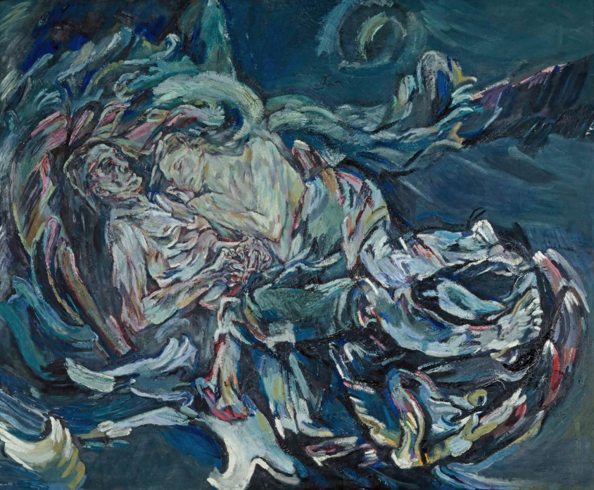
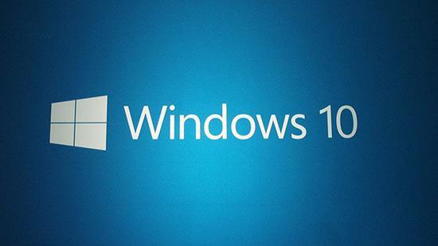

# xieguaiwu
---

## Languages
> A whole mythology is deposited in our language.

---

## Aesthetical Preference

Coding theme: Monokai-Pro

---

## Tools
### 1. OS

### 2. Text Editor

<!--
**xieguaiwu/xieguaiwu** is a ✨ _special_ ✨ repository because its `README.md` (this file) appears on your GitHub profile.
